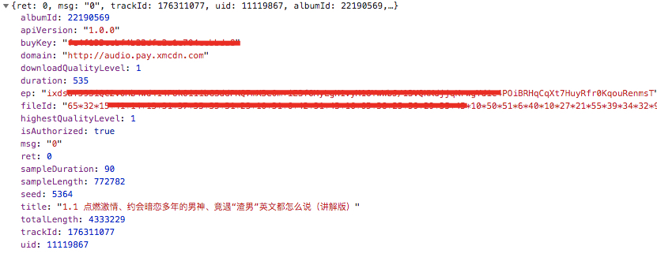

# ximalaya-audio

[喜马拉雅](https://www.ximalaya.com/) 请求头字段 xm-sign 解析和付费音频地址分析（非破解）

## xm-sign 字段

> 如果不带该字段会有一定几率出现 403 错误

直接调用 `xmSign` 可以获得 xm-sign (会使用定时器与服务器持续交互获得最新时间戳)

## 付费音频地址

先获取音频信息：

[https://mpay.ximalaya.com/mobile/track/pay/176311077?device=pc&isBackend=false&\_=1557457172754](https://mpay.ximalaya.com/mobile/track/pay/176311077?device=pc&isBackend=false&_=1557457172754)

如下：

返回信息作为入参出入 `payAudio` 即可获得带验证地址。
